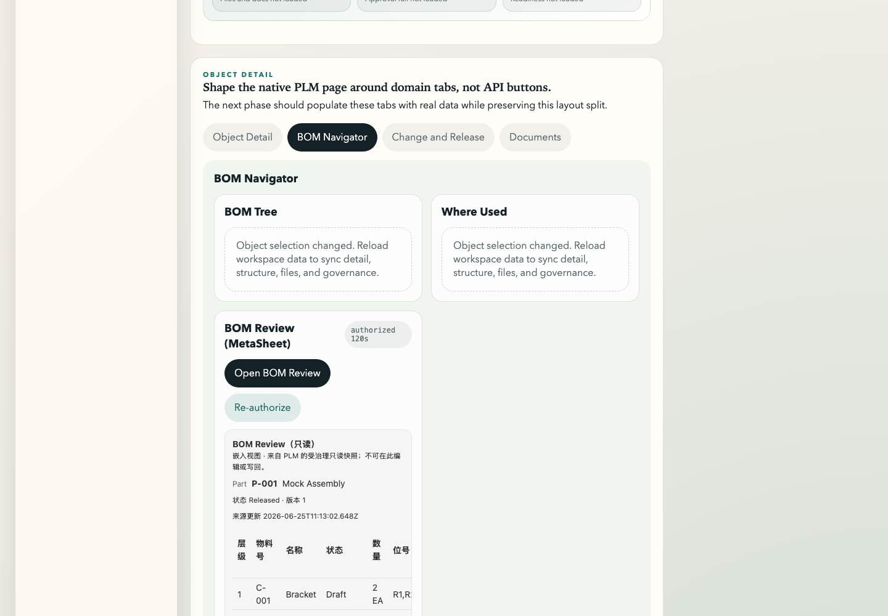

# PLM x MetaSheet V1.2 public-origin staging evidence

Date: 2026-06-25T11:19:41Z

## Scope

This records the V1.2 in-PLM embedded BOM Review staging run after the PactFlow broker line and the parent-host/runtime fixes landed.

Origins used:

- PLM parent: `http://plm.23.254.236.11.sslip.io`
- MetaSheet embed: `http://ms.23.254.236.11.sslip.io/plm-embed/bom-review`

These are public DNS-backed staging origins via sslip.io and nginx host routing. They are not production domains and not HTTPS, but they are not localhost tunnels.

No bearer token, private key, public key, license payload, or embed token value is recorded here.

Screenshot evidence:

## Mainline state

Yuantus:

- PactFlow activation: #861 merged `a352baa9e090609cfba2456b9474a8b219a66904`
- PactFlow blocking flip: #864 merged `bf0f9e552b1dfc6ed621c9acbfd0de07d1afdb60`
- Broker script cleanup: #867 merged `d20ce5438350f08fb16df0220e677dbe1303b857`
- can-i-deploy selector fix: #869 merged `aac14ca663bbe307e4c7b767af787c26f8bbd034`
- broker ops runbook: #870 merged `2af0b3af8624f61cf93cd829ab15a1487c0872a7`
- V1.2 instrument: #871 merged `a1ff1641c721e9aef9755bfec223858a451743c4`
- V1.2 gate-framing fix: #872 merged `84f78ffd9b34016220ba4ad4027656c7631ab0e6`
- packaged HTML staging fix: #873 merged `2220f0e18dea472d08dd951eaf7b74100d0a8752`
- iframe postMessage boot retry: #874 merged `6d4d7fa394037497380544d1d1002872e6607520`

MetaSheet2:

- consumer pact/broker publish line: #3065 merged `bfedff511f78d3b2026a89022473a7d42bf4fc09`
- persisted PLM data-source runtime fix: #3200 merged `0df197578e9a692483618920659201f8ed973acd`

## Runtime configuration

Public host routing:

- `plm.23.254.236.11.sslip.io` proxies to Yuantus staging API.
- `ms.23.254.236.11.sslip.io` proxies to MetaSheet2 staging web/backend.

Yuantus:

- `YUANTUS_METASHEET_EMBED_URL` points to `http://ms.23.254.236.11.sslip.io/plm-embed/bom-review`.
- `YUANTUS_EMBED_ALLOWED_ORIGINS` allows `http://ms.23.254.236.11.sslip.io`.
- Workspace HTML injects the public embed URL.
- Workspace HTML includes the bounded postMessage retry loop from #874.

MetaSheet2:

- `/api/plm-embed/config` returns exactly two allowed origins for this staging run:
  - `http://plm.23.254.236.11.sslip.io`
  - `http://ms.23.254.236.11.sslip.io`
- The `plm-v12-staging` persisted data source loads at runtime after #3200.

## #871 observable checklist

| # | Check | Result | Evidence |
|---|---|---|---|
| 1 | Entitlement / config gate | PASS | Entitled + configured tenant shows the BOM Review button. Temporary unconfigured check hid the button: `unconfigured_button_visible=false`, `unconfigured_card_hidden=true`, `unconfigured_html_has_embed_url=false`. |
| 2 | Real iframe opens | PASS | Browser run loaded iframe with `public_v12_iframe_src_exact=true`; frame origin was `http://ms.23.254.236.11.sslip.io`. |
| 3 | Exact-origin handoff | PASS | Parent origin `http://plm.23.254.236.11.sslip.io`; embed origin `http://ms.23.254.236.11.sslip.io`; context call returned `public_v12_context_http=200`; review rendered. |
| 4 | Token not in URL | PASS | `public_v12_no_token_url=true`; iframe `src` equals the embed URL and contains no token. |
| 5 | Token not in storage | PASS | `public_v12_no_token_storage_both_origins=true` across parent and iframe origins. |
| 6 | Token not in logs / request URLs | PASS | `public_v12_no_token_console=true`; request URL check passed; recent Yuantus and MetaSheet backend logs had zero matches for the current embed-token prefix. |
| 7 | Token not in screenshot | PASS | Screenshot saved at `docs/development/assets/plm-collab-v1-2-public-staging-20260625.png`; visual inspection showed BOM Review content and no token. Page text JWT-shape check returned false. |
| 8 | Expiry / replay -> re-authorize | PASS | Re-authorize was exercised by clicking twice: both runs returned mint `200`, context `200`, and rendered successfully. |
| 9 | 403 degradation | PASS | Bad origin request returned `public_bad_origin_http=403` with safe body `embed origin not allowed`. |
| 10 | 503 degradation | PASS | Malformed signing key after API health returned `public_invalid_key_after_health_http=503` with safe body `embed token minting unavailable`; configuration was restored and final happy path passed. |

## Final health check

After temporary degradation tests were restored:

- `post_503_restore_health_http=200`
- `post_503_restore_mint_http=200`
- `post_503_restore_token_present=true`
- `final_restore_public_smoke_mint_http=200`
- `final_restore_public_smoke_context_http=200`
- `final_restore_public_smoke_frame_renders=true`

## Trialability decision

Trialable for the V1.2 staging loop on temporary public sslip.io origins.

Remaining operational hardening before production-style customer trial:

- Replace sslip.io HTTP origins with owned HTTPS staging domains.
- Keep the current exact-origin model when migrating domains.
- Do not move V2 commercial features forward from this evidence; V2 remains deferred.
